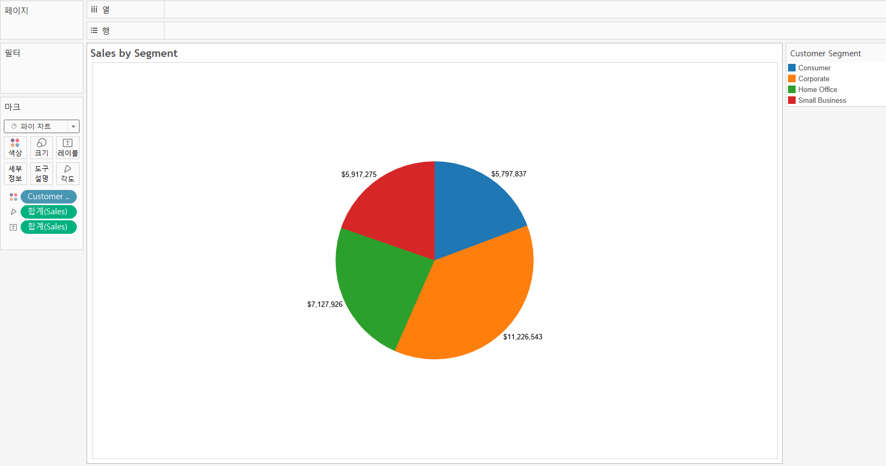
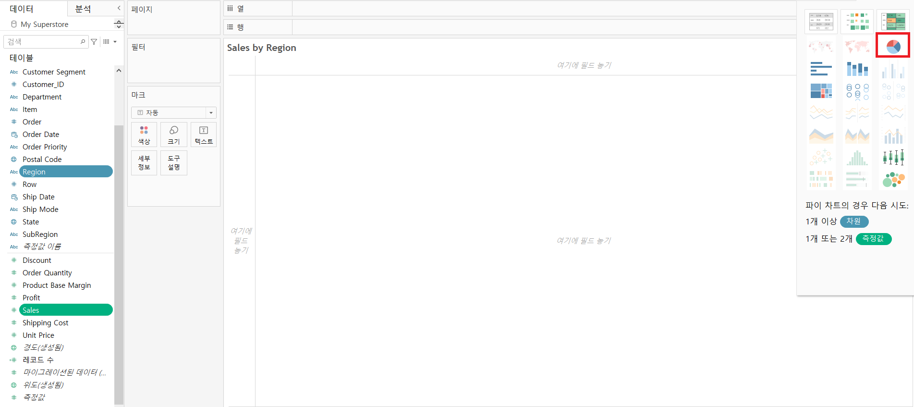
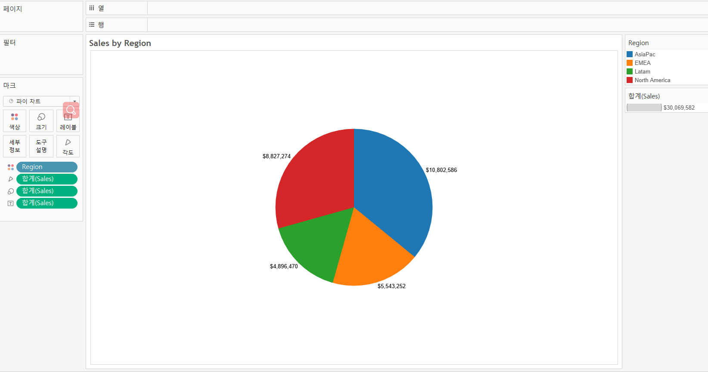
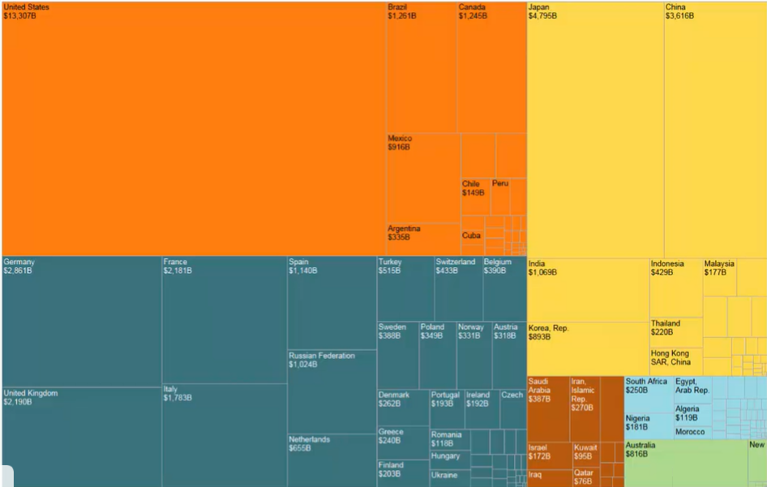
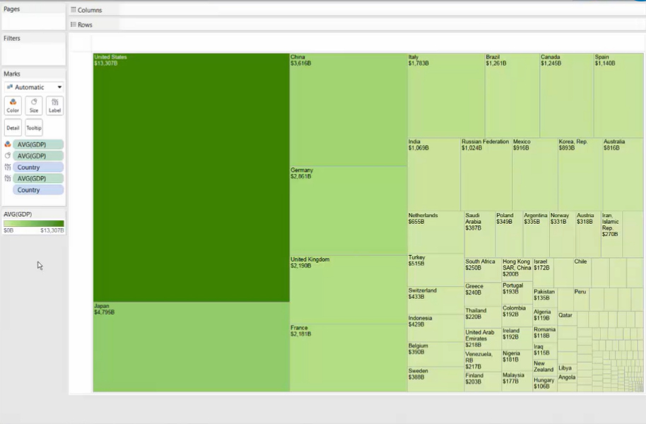
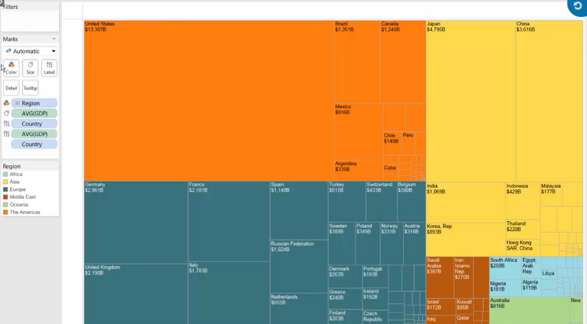
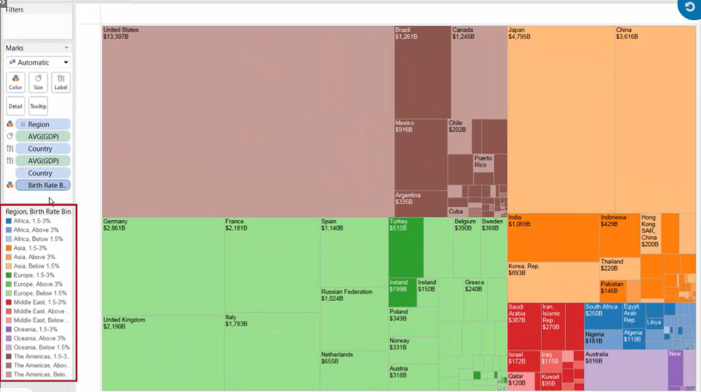
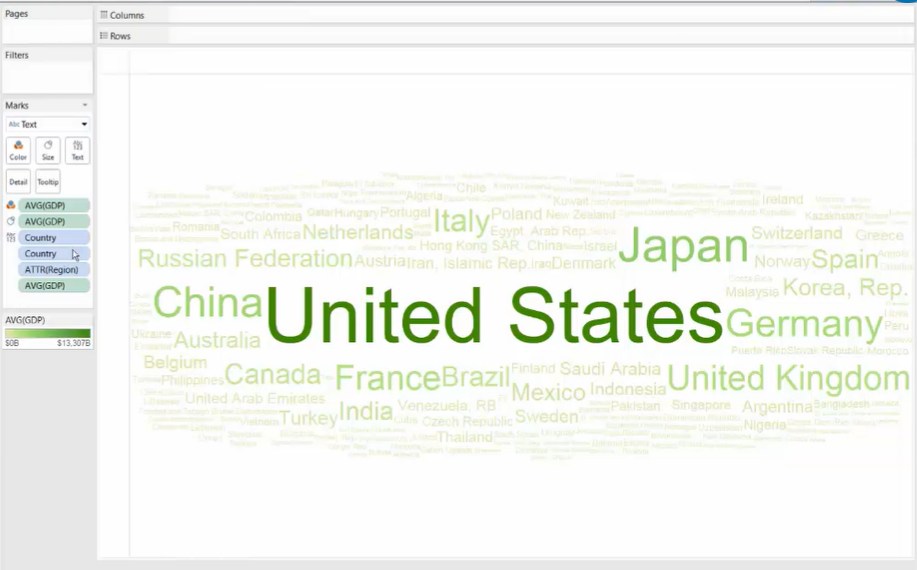
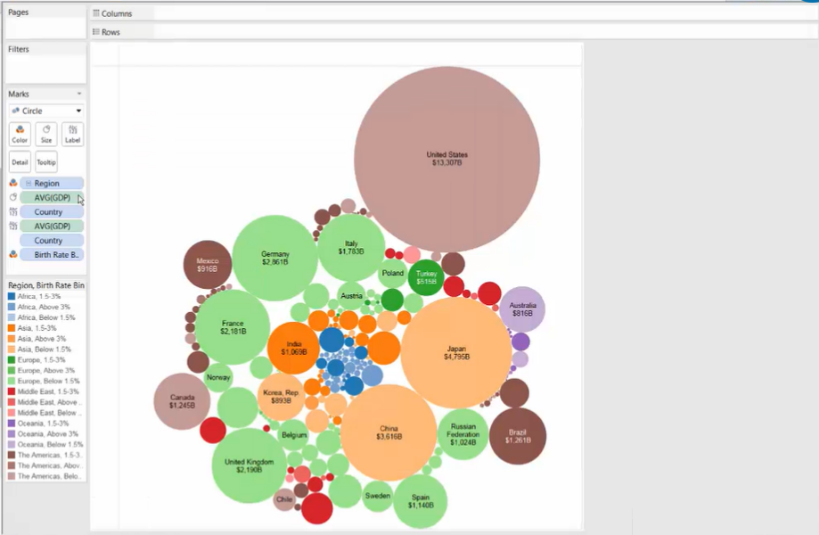
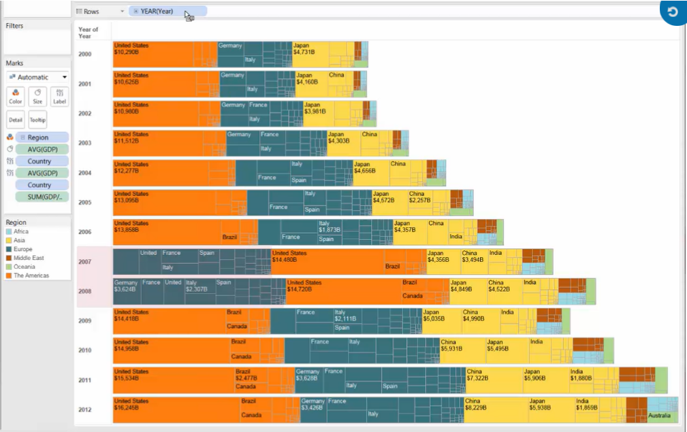

# Showing the Breakdowns of the Whole (Pie Chart & Tree Map)

@[toc]

## **1. Pie Chart**

### \>> Create a pie chart

**Method 1:** Use Marks

* Mark : Pie Chart
* [Color] : dimension field   [best: within 5 dimension members]
* [Angle] : measure field

**Method 2:** Use [Show Me]

* Choose [dimension field] and [measure field]
* click [Show Me] --> [Pie Chart]

## **2. Tree Map**

If you have hierarchical data, or data with more than 5 dimension members, a pie chart is not ideal. Instead, a treemap may be a good choice.

**Treemaps**:

* using [nested rectangles] to show [hierarchical data] as a part of the whole
* the square shape helps your eye to compare relative sizes

### \>> Build a treemap

#### Style 1: one dimension

* [Color] & [Size] : 1 measure field
* [Detail] :               1 dimension field
* [Label] :                measure & dimension

#### Style 2: two dimensions (hierarchical data: Region -> Country) 

* [Color] :  1st dimension field (Region)   [best: within 7 colors]
* [Size] :     1 measure field
* [Detail] :  2nd dimension field (Country)
* [Label] :   measure & dimensions 

#### Style 3: add a second color (3 dimensions)

* [Color 1] :  1st dimension field (Region)   
* [Size] :        1 measure field
* [Detail] :     2nd dimension field (Country)
* [Color 2] :   3rd dimension field (Birth Rate Bin)  [*add shades of color*]
* [Label] :      measure & dimensions 

#### Style 4: Word Cloud

Treemap -->  change the Marks to [Text]

#### Style 5: Bubble Chart

Treemap --> change the Marks to [Circle]

#### Style 6: add a dimension to rows

