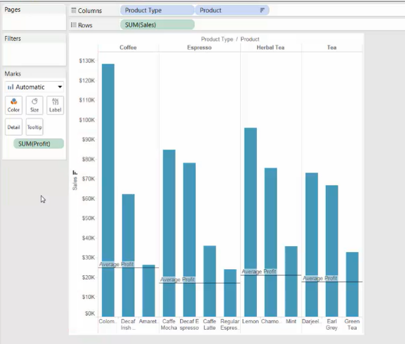
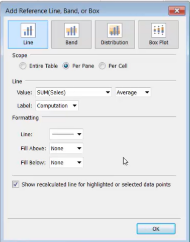
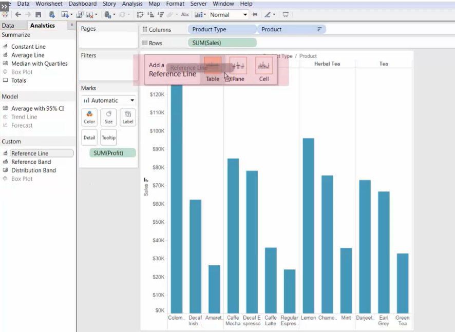
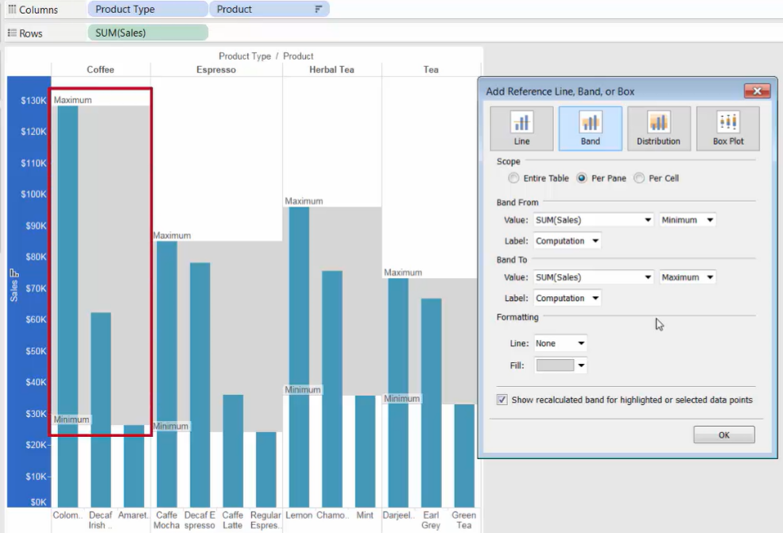
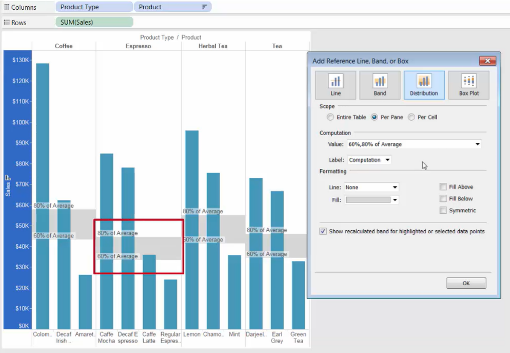
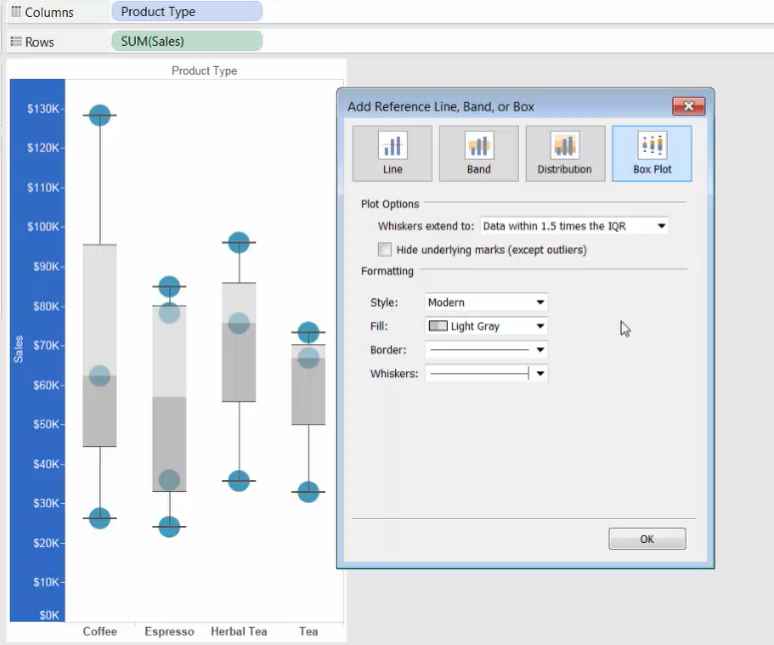

# Highlighting Data with Reference Lines

@[toc]

#### \>> Reference Line

**2 ways to add reference line**

1. From the view: 

   * Right-click the axis --> Add Reference Line

      

     \* [Line] --> [Value] only displays the *measures in our view*

     

2. From the Analytics pane

   * Analytics --> Drag [Reference Line] to the view

      

     

#### \>> Reference Band

Reference Bands 

* display data that falls within a certain window value
* and display as shaded areas between two constant or computed values

#### \>> Reference Distribution

Reference Distributions 

* are a variation of reference Bands
* It adds a gradient of shading to indicate the distribution of values along the axis

#### \>> Reference Box Plot

Reference Box Plots describe the distribution of values along the axis

