# Create Dashboards and Stories

@[toc]

## **1. Plan for a Successful Dashboard**

#### \>> Considerations for planning a dashboard

* **Who is your audience?**

  * determine which chart to use
  * how you arrange the charts on the dashboard
  * the level of detail
  * the level of interaction

* **What information is important to your audience?**

  * consider what the key takeaways are for your audience

  * simple and only includes relevant information
  * consistent design, language and color scheme

* **Why are you creating a dashboard?**

  * a conclusion or a key question?
  * to inform your users?
  * to explore the data?

* **Where is the dashboard going to be viewed?**

  * viewing on different size devices? (desktop, laptop, tablet, phone?)
  * print the dashboard?
  * look at offline?

#### \>> Steps for planning a dashboard

**Four General Steps**

1. Determine purpose + audience
2. Plan the dashboard
3. Build using design best practices
4. Test it for usability and performance

## **2. Creating a Dashboard**

#### \>> Add views to a dashboard

1. Create a new dashboard

   * click the [New Dashboard] icon 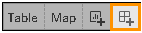

2. Add views to a dashboard

   * drag the worksheet in the [Sheets] list to the canvas

3. Replace one worksheet with another

   * select the worksheet in the dashboard view

   * in the [Sheets] list, hover over the title of the worksheet you would like to use and click the [Swap Sheets] icon

   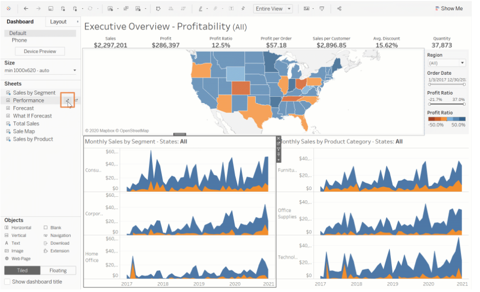

4. Return to worksheet in three ways

   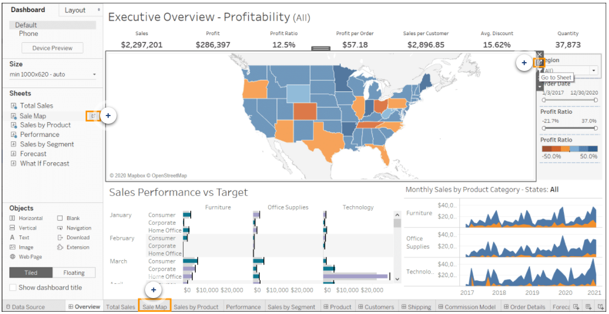

#### \>> Dashboard Settings

* **Dashboard Panel**

  * [Device Preview] : to see what your dashboard would look like on certain devices

  * [Size] : Fixed Size / Automatic / Range 

  * [Sheets] : Sheet names of the views in this workbook that  can be used to build your dashboard

  * [Objects] : containers, images, text or web pages that can be added to a dashboard

    \- Object layout: Tiled (arrange in a single layer grid) / Floating (freely moved on the dashboard)

  * [Show dashboard title]

* **Layout Panel**

  * [Item hierarchy] 

    \- contains all the floating objects and any tiled objects listed in a hierarchy

    \- selecting any object on the list will highlight it in the view

    ​	\* containers framed in blue

    ​	\* sheets framed in gray

  * [Settings] : adjust objects' position and size

    \- tiled objects are fixed (can't change the position or size)

#### \>> Highlight and filter data in dashboards

* **Legend Highlights**

  * Legend highlights help the data to stand out from other marks
  * activate: [Legend] Card --> select Highlight Selected Items

* **Use a view as a filter**

  * means the marks you select in one view will filter the results of the other views in your dashboard

* **Apply the filter to all sheets**

  * filter card --> [Apply to Worksheets] --> [All using This Data Source]

    

## **3. Creating Interactive Dashboards Using Actions**

#### \>> Actions in Tableau

* **Filter Action**
  * Using the data from one view to filter data in another
  * Typically, a filter action sends information from a selected mark to another sheet showing related information
* **Highlight Action**
  * Allow you to call attention to marks of interest by retaining color for specific marks and dimming all others
  * Several methods to highlight marks
    1. Manually select the marks you want to highlight
    2. use the legend to select related marks
    3. use the highlighter to search for marks in context
    4. create an advanced highlight action
* **Go to Sheet Action**
  * Navigation to other worksheets, dashboards, or stories
* **Go to URL Action (Tableau Desktop Only)**
  * Create hyperlinks to external resources, such as a web page, email link, or a file
* **Parameter and set actions (Tableau Desktop Only)**
  * Parameter actions: Let your audience change a parameter value through direct interaction with a viz
  * Set actions: Let users change the values in a set by directly interacting with marks on a viz

#### \>> Methods for running an action

* **Hover**
  * Rest the mouse pointer over a mark to run the action
  * Works well for highlight actions
* **Select**
  * Click a mark to run the action
  * Works well for most types of actions except URL actions
* **Menu**
  * Click a selected mark --> select an option on the tooltip
  * Works well for URL actions

#### \>> Add actions to a dashboard

##### 1. Filter Action

* **Concept:** 

  * Filter actions create a filter on a target sheet based on a selection at the source sheet

  * With filter action, you can use the data from one view to filter data in another

* **Caution:** The filter chosen must in both the source and target sheets

* **Create a filter action**:

  * [Dashboard] --> [Actions]

    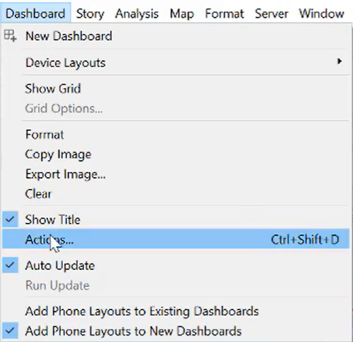 

  * [Add Action] --> [Filter]

    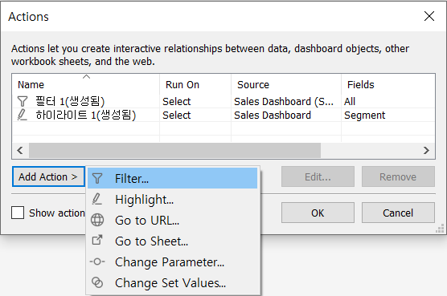  

    

* **Edit a filter action:**

  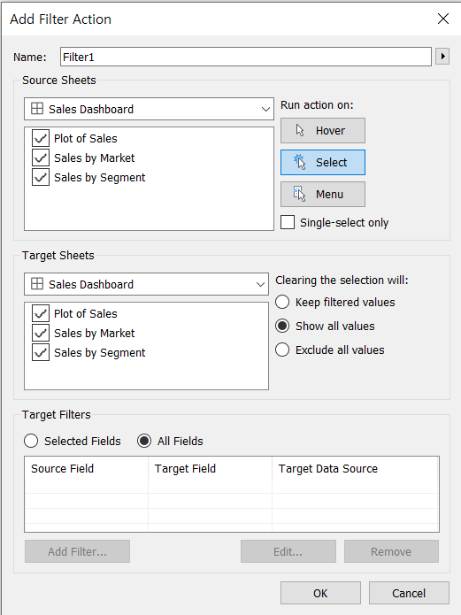  

  * Filter Action Name

  * Source Sheets
  * Run action on: Hover / *Select* / Menu
  * Target Sheets
  * Clearing the selection will:
    1. Leave the filter:       the filter stay in place until the next selection
    2. Show all values:      returns the view to an unfiltered state
    3. Exclude all values:  remove the marks and axes of target sheets from the view
  * Target Filters:
    1. select specific fields to respond to this filter action
    2. let all fields respond to this filter action

  

##### 2. Highlight Action

* **Concept:** Highlight actions are used to call attention relevant data by retaining color for some marks while dimming all the others

* **Create a highlight action:**

  * [Dashboard] --> [Actions]

     

  * [Add Action] --> [Highlight]

    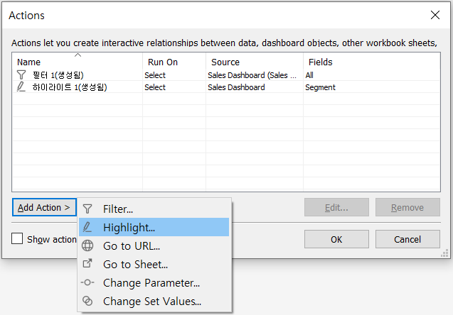 

    

* **Edit a highlight action:**

  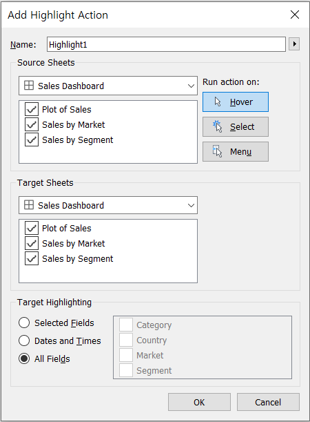  

  * Highlight Action name
  * Source Sheets
  * Run action on: *Hover* / Select / Menu
  * Target Sheets
  * Target Highlighting: the types of fields that will be highlighted
    1. Selected Fields
    2. Dates and Times
    3. All fields

##### 3. Go to Sheet Action

* **Concept:** The Go to Sheet action allows users to go from one dashboard to another sheet or dashboard.

* **Create a Go to Sheet action**:

  * [Dashboard] -- > [Actions]
  * In the [Actions] dialog box, [Add Action] --> [Go to Sheet]

* **Edit a Go to Sheet action**

  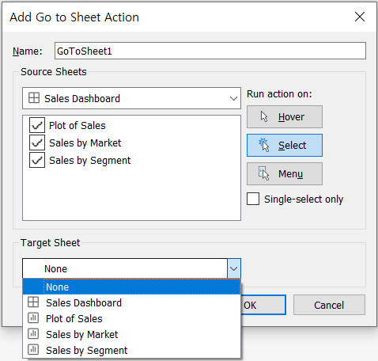 

  * Go to Sheet action name
  * Source Sheets
  * Run action on: Hover / Select / Menu
  * Target Sheets

##### 4. Go to URL Action

* **Concept:** URL actions allow end users to connect to web-based resources, and these can by dynamically programmed to update based on the user's selection.

* **Create a Go to URL action:**

  * [Dashboard] --> [Actions]
  * In the [Actions] dialog box, [Add Action] --> [Go to URL]

* **Edit a Go to URL action: **

  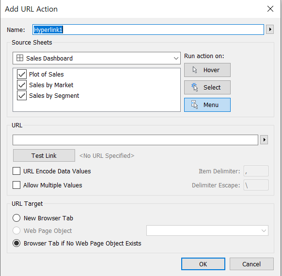  

  * Go to URL Action name
  * Source Sheets
  * Run action on: Hover / Select / *Menu*
  * URL: with an ftp, http, or https prefix
  * Arrow button at the right of the URL box: enter field and filter values as parameters in the URL

## **4. Refining a dashboard**

#### \>> Start with the layout

* **Select worksheets to include**

* **Set the layout orientation with containers** 

  * Horizontal layout container
  * Vertical layout container

   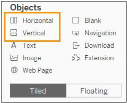   (More Info. : [Size and Lay Out Your Dashboard](https://tabsoft.co/dashboardlayout))

* **Use non-worksheet objects**

  * Text
  * Image
  * Web Page
  * Navigation : Add a button that navigates to another dashboard or sheet
  * Extension : Insert a dashboard extension
  * Export : Add a button to allow dashboard consumers to export the dashboard according to the export type you determine (PDF, PowerPoint, or Image)

* **Consider Floating a view**

  * To save space or improve its proximity to another item, you can float a view, filter, legend, text, image, web page, or even a layout container

* **Add white space**

  * **Two methods:**

    1. Insert and resize a blank container
    2. Adjust either the outer or inner padding of a view, container, or object

  * **Padding:**

    1. [Inner Padding] : sets the spacing between item contents and the perimeter of the border and background color
    2. [Outer Padding] : provides additional spacing beyond the border and background color

    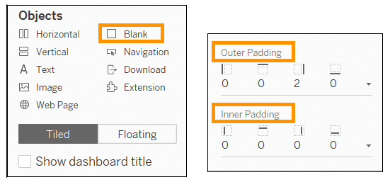

* **Use borders and background colors sparingly**

#### \>> Determine the device layout (Tableau Desktop Only)

**Step 1. Make a dashboard by using the default**

* The default dashboard acts as a template for other device layouts
* Only sheets that are put onto the default dashboard will be available for the device specific layouts

**Step 2. Add a device layout**

* [Dashboard] Pane --> click [Device Preview]

  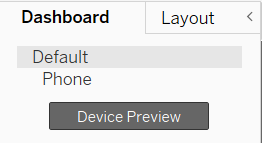

* Choose a layout in [Device Preview Bar]:

  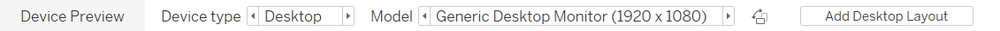 

  * Device Type: Default / Desktop / Tablet / Phone
  * Screen Orientation: Landscape (가로) / Portrait (세로)

* click [Add ** Layout]

**Step 3. Edit the layout added**

* **Size**

  * Default:   keeps the size from the default dashboard

  * Fit all:       fits all the dimensions like automatic sizing on the default

  * Fit width: fits the dashboard horizontally but allows a hard-coded height

    ​				  (It means the user would scroll vertically to consume the entire dashboard)

* **Layout**

  * Default
  * Custom : Available to edit

#### \>> Color, sizing and fonts

* **Color**

* **Sizing**

  * Keep users' screen size in mind
  * When using **crosstabs**, don't use Fit Entire View; use a combination of a scroll bar and either **Fit Width or Fit Height** 
  * To resize **elements**, try **Shift+drag**
  * To resize **individual worksheets**, use **CTRL** and the arrow keys to resize rather than manually dragging

* **Font**

  * The quickest way to make a fast, large-scale change to all the titles in your dashboard is to change them at the workbook level (A workbook is the largest possible container for formatting settings) :

    1. Click [Format] --> Select [Workbook]

    2. Edit in [Format Workbook] Pane --> [Fonts]

       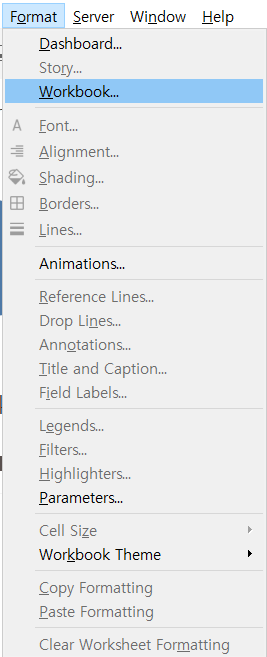		  

#### \>> Tooltips

* **Customize tooltips:** 

  * [Worksheet] --> [Tooltip]

* **Add visualizations in tooltips**

  * **Viz in tooltips:**

    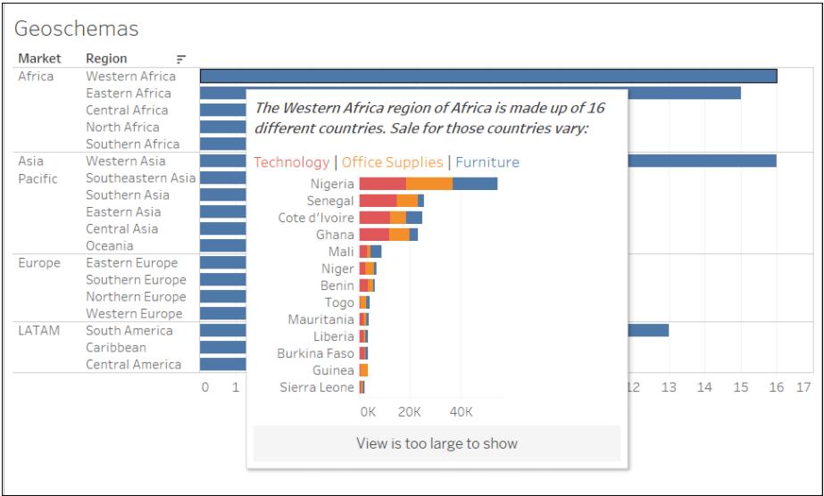

  * **Add a viz in tooltip**

    1. From the main (source) viz, click [Tooltip] on the [Marks] card.

    2. Click [Insert]  --> [Sheets]

       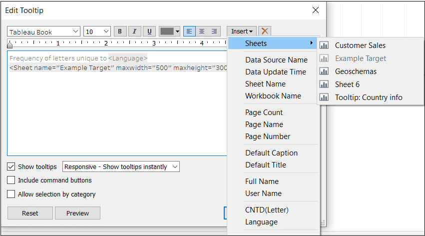

    3. Select the target sheet that should appear in the tooltip --> click [OK]

  * **Learn more**

    1. You can set the size of a view in a tooltip

       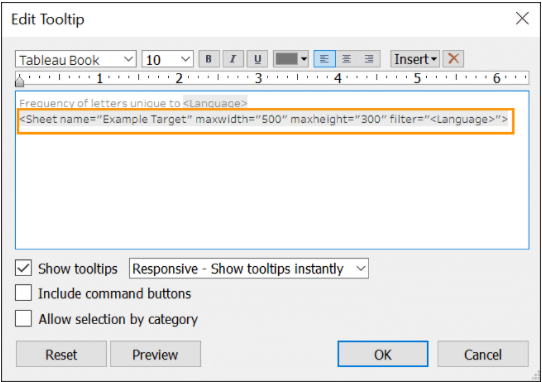

    2. The view in the tooltip is always static

       \- The viz in the tooltip is a static image, not an interactive viz.

       \- Multiple target sheets can appear in the same tooltip

    3. It's possible to format tooltip text

       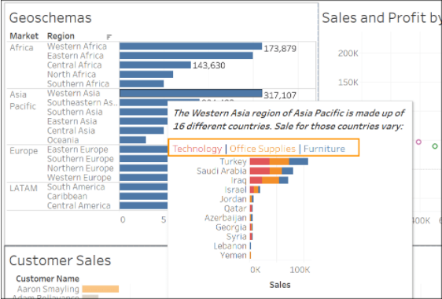

    4. Hovering on a mark filters the target viz

       \- On the sheet for the target viz, there is a "tooltip" filter on the [Filters] shelf

       \- When a tooltip containing a viz is displayed, the target viz is filtered based on the mark you're hovering over

    5. Show Me resets the tooltip

       \- If you use [Show Me] in the source sheet to change the view structure, you will reset all tooltip edits, including Viz in Tooltip references.

