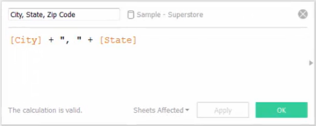
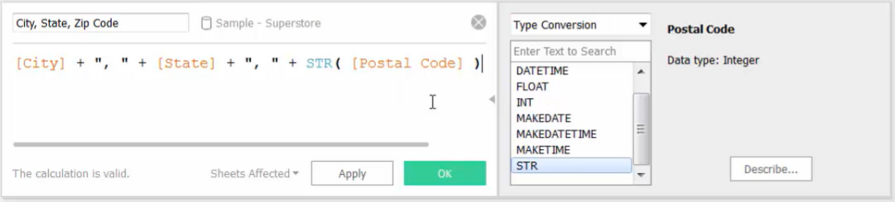
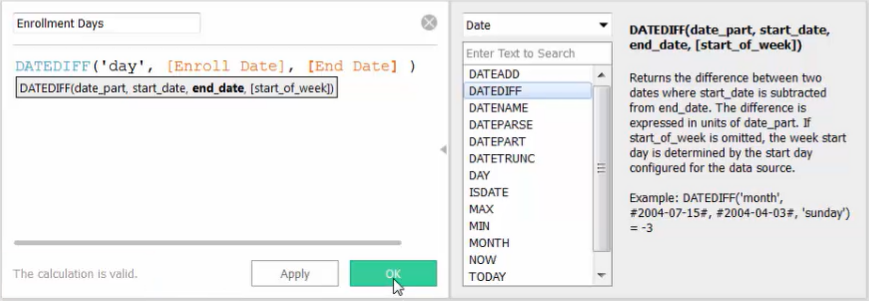

# Using Calculations

@[toc]

## **1. Working with Strings and Type Conversion Functions**

#### Concatenate string fields

To concatenate strings means to add them together

* Use "+" operator to connect strings

   

  

* For fields with other data types, use type conversion function "STR()" to change them into strings

   

 

## **2. Working with Dates**

#### Using Date-specific Calculations

> [[Tableau Help] -- Date Functions](https://help.tableau.com/current/pro/desktop/en-us/functions_functions_date.htm)

**[Example - DATEDIFF]**

DATEDIFF: Returns the difference between two dates. The difference is expressed in units of date_part

## **3. Working with Aggregations**

When dragging [measure] fields into the view, Tableau automatically aggregates [measure] to the lowest level of detail in the view.

|                       Calculated Field                       |                     Bring into the view                      |                     Order of Operations                      |
| :----------------------------------------------------------: | :----------------------------------------------------------: | :----------------------------------------------------------: |
|  |  | 1. calculate the ratio for each row 2. sum the results of those ratios |
|  |  | 1. sum the Profit values and Sales values 2. divide two totals and calculate the ratio |

\* When you pre-define aggregation in a calculated field, Tableau won't perform further aggregation when you bring the field into the view. Instead, Tableau adds an "AGG" at the start of the field to indicate that the aggregation was pre-defined in the calculation.

**[calculation without aggregation]  VS  [calculation including aggregation]**

|                               |               calculation without aggregation                |              calculation including aggregation               |
| :---------------------------: | :----------------------------------------------------------: | :----------------------------------------------------------: |
|          **Example**          |  |  |
|      **Level of Detail**      | 1. first performed at the row-level detail 2. then aggregated and brought into the view |    the result will be at the level of detail in the view     |
| **Brought into  the view** |              perform aggregation automatically               |            further aggregation can't be performed            |

