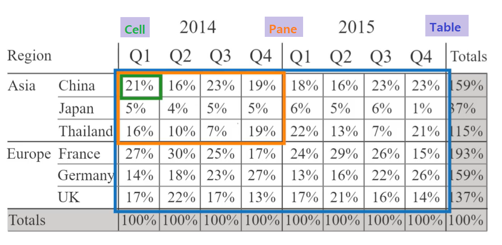

# Using Quick Table Calculations to Analyze Data

@[toc]

#### \>> Concept: Table calculations

Table calculations are 

* computations that are applied to the values in the data table for the view 
* and calculations available often dependent on the table structure itself

#### \>> Quick Table Calculations

Quick Table Calculations:

* Running Total	         (汇总)	
* Difference                   (差异)
* Percent Difference    (百分比差异)
* Percent of Total         (合计百分比)
* Rank                             (排序)
* Percentile                    (百分位)
* Moving Average         (移动平均)
* YTD Total : *same as Running Total, but is running along the date dimension and restarting for event Year part of the date dimension*     (YTD总计)
* Compound Growth Rate (통합 성장률 / 复合增长率)
* Year over Year Growth  (전년대비 성장률 / 年度同比增长)
* YTD Growth : *compares the YTD Total of current year with YTD Total for the previous year*  (YTD增长)

> [Running Total vs YTD Total vs YTD Growth](https://public.tableau.com/views/TableCalculations-RunningTotalvsYTDTotalvsYTDGrowth/TableCalculations-YTDvsRunningTotal?%3Aembed=y&%3AshowVizHome=no&%3Adisplay_count=y&%3Adisplay_static_image=y&%3AbootstrapWhenNotified=true)
>
> YTD (Year to Date): The period from the beginning of a fiscal year to the end of a reporting period. (올해 초부터 현재까지)

#### \>> Calculation Scope and Direction

**Scope**: Table / Pane / Cell    (*Scope: the segment of the table that the calculation is applied to*)

​			 

**Direction:** across / down / across then down / down then across
